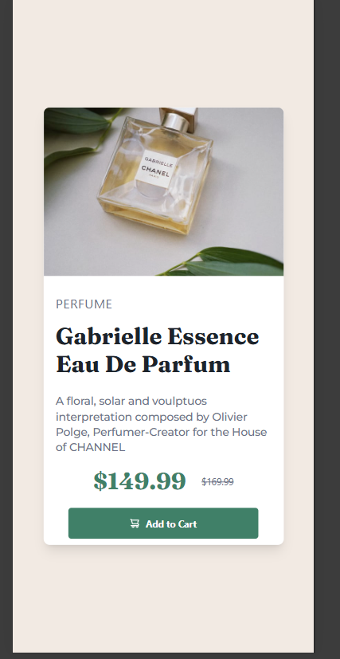

# Frontend Mentor - Product preview card component solution

This is a solution to the [Product preview card component challenge on Frontend Mentor](https://www.frontendmentor.io/challenges/product-preview-card-component-GO7UmttRfa). Frontend Mentor challenges help you improve your coding skills by building realistic projects. 

## Table of contents

- [Overview](#overview)
  - [The challenge](#the-challenge)
  - [Screenshot](#screenshot)
  - [Links](#links)
- [My process](#my-process)
  - [Built with](#built-with)
  - [What I learned](#what-i-learned)
  - [Continued development](#continued-development)
  - [Useful resources](#useful-resources)
- [Author](#author)


## Overview

### The challenge

Users should be able to:

- View the optimal layout depending on their device's screen size
- See hover and focus states for interactive elements

### Screenshot





### Links

- Solution URL: [Add solution URL here](https://your-solution-url.com)
- Live Site URL: [Add live site URL here](https://your-live-site-url.com)

## My process

### Built with

- Semantic HTML5 markup
- Flexbox
- CSS Grid
- [React](https://reactjs.org/) - JS library
- [TailwindCSS](https://tailwindcss.com/)
- [Vite](https://vite.dev/)

### What I learned

This is my first time working with REACT+TailwindCSS, so at the beggining I needed to change my mindset to start thinking on "components" that I may reuse on the future or that lead to enhance escalability in the future. 

I also learned that on the v4.1 of TailwindCSS a lot of the settings changed, as for example, the @tailwind directives were removed and know you only use @import "tailwindcss"; on your CSS file.  

To add custom themes is no longer needed ot have a "tailwind.config.js" file, you can do it using @theme on the CSS. 

Some of the code I'm proud (even knowing I can do better in the future) of:

```JS+React:
export default function App() {
  return (
    <div className="flex justify-center items-center min-h-screen min-w-screen bg-cream">
      <div className="w-[90vw] max-h-[95vh] px-5 md:max-w-[30vw] md:max-h-[60vh]">
        <ProductCard 
        pType='PERFUME'
        pName='Gabrielle Essence Eau De Parfum'
        pDescription='A floral, solar and voulptuos interpretation composed by Olivier Polge, Perfumer-Creator for the House of CHANNEL'
        pNewPrice='149.99'
        pOldPrice='169.99' 
        pImageMobile={productImageMobile}
        pImageDesktop={productImageDesktop}
        />
      </div>
    </div>
  );
}
```
```css
@theme {
  /* --- Colores --- */

  /* Primarios */
  --color-green-500: hsl(158, 36%, 37%);
  --color-green-700: hsl(158, 42%, 18%);

  /* Neutrales */
  --color-black: hsl(212, 21%, 14%);
  --color-grey: hsl(228, 12%, 48%);
  --color-cream: hsl(30, 38%, 92%);
  --color-white: hsl(0, 0%, 100%);

  /* --- Fuentes --- */

  /* Para la tipografía principal (Body Copy) */
  --font-body: "Montserrat", sans-serif;
  --font-size-body: 14px;

  /* Para títulos o elementos que requieran la fuente Fraunces */
  --font-headings: "Fraunces", serif;

}
```


### Continued development

I want to refine my abilities on TailwindCSS as I found it very useful, also I believe it helps to mantain a clean and scalable code.

### Useful resources

- [TailwindCSS docs - Adding custom Styles](https://tailwindcss.com/docs/adding-custom-styles) - This helped me with the changes on the new version v4.1 on TailwindCSS, as there were big changes from v3 to v4. 

## Author

- Website - [Alejandro Ojeda](https://alejo2304.github.io/)
- Frontend Mentor - [@Alejo2304](https://www.frontendmentor.io/profile/Alejo2304)
